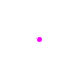

# 制作 SVG+P 动画
SVG+P （参量SVG）是一种 GAS 支持的基于SVG结构的动画对象，SVGP本身时间轴以及图像均是相对的，
以方便在正式GAS弹幕中引入。

SVG+P 动画相比普通 SVG 的区别是其提供了一个 `t` 参数用来控制播放。这个参数为取值在 [0,1]
区间的一个数字。当引入 GAS 时，这个参数可以同任何其他参数（比如 width，height）一样，参与
动画关键帧。可以把它想象为一个唱片机上的唱片，通过你的转动正向或是反向产生动画效果。

## 参量化入门
相比于传统 GAS 接受的 SVG，SVG+P允许在定义SVG时，把一些属性的值和不确定的参量进行绑定。在渲染
时，由于参量会被赋值，则可以计算实际显示 SVG 的。参量连续变化则产生了动画的效果。

比如下面这个例子代表一个SVG圆圈：
````json
{
  "type": "svg",
  "viewBox": [0, 0, 100, 100],
  "children": [
    {
      "type": "circle",
      "cx": 50,
      "cy": 50,
      "r": 50,
      "fill": "#ff00ff",
      "stroke": "none"
    }
  ]
}
````


假如我们希望制造一个这个圆圈以目前圆心，从一个点逐渐变大的动画。我们可以首先将其半径设定为一个
根据时间变化的参量（比如 `50 * t`）那么相应的 SVG+P 则会表现为如下的定义：

````json
{
  "type": "svg+p",
  "viewBox": [0, 0, 100, 100],
  "children": [
    {
      "type": "circle",
      "cx": 50,
      "cy": 50,
      "r": {
        "type": "rpn",
        "src": [50, "$t", "*"]
      },
      "fill": "#ff00ff",
      "stroke": "none"
    }
  ]
}
````


这样当 `t` 从 `0` 变化到 `1` 时，图中的圆圈的半径也随之从 `0`增加到`50`。

## 参量表达式
从上面的例子，我们可以大致看到参量化SVG的基本用法：把我们想要参量化的属性找出来，把定义内的
固定的值改成一个用来表达参数公式的对象即可。那么究竟如何定义这个参数公式对象呢？GAS 的 SVG+P
提供了以下几个简单的方法。

### 逆波兰表示法 (Reverse Polish Notation, `rpn`)
上面我们看到的例子中，我们想要表达的是 `r = 50 * t`，其中一个简单的方法就是直接写出来表达式。
不过传统的中缀表达式（形如 `a + b * c`）虽然直观，但是需要使用特舒符号（括号）控制运算顺序。
为了能更灵活且简介的描述表达式，我们采取了逆波兰表示法来定义式子。这种表示法无需使用括号，仅仅
由各种操作符的顺序即可唯一判断运算顺序。

具体的逆波兰表示法读者可以自行寻找资源进行学习，不过这里给出一些简单的直觉概念：逆波兰表示法就是
把运算的 **参数** 放在 **运算符** _前面_ 的表达式表示方法。比如 `1 + 2 + 3` 则可以写成
`1 2 + 3 +`。这里 `1 2 +` 表示了使用参数 `1` 和 `2` 进行 `+` 运算，产生的结果，以及 `3`
作为两个参数再进行 `+` 运算。这样我们同样可以简答的区分 `(1 + 2) * 3` 和 `1 + 2 * 3`，
他们的表达式分别为 `1 2 + 3 *`（先`+`再`*`）和 `1 2 3 * +`（先`*`在`+`）。

这样由足够运算符的前提下，我们写出任意复杂度的的基于输入参数的表达式。默认我们支持如下运算符：
- 1个参数：`abs`（绝对值），`floor`（向下取整），`ceil`（向上取整），`round`（四舍五入）
- 2个参数：`+`, `-`, `*`, `/`, `**`（次方），`max`（取大），`min`（取小）
- 3个参数：`if`（如果第一个参数大于 `0`，则返回第二个参数，否则返回第三个参数）

当然了，表达式中还需要有参量才有意义（否则返回值就是常数了嘛）。在表达式中可以用 `$name` 来
表示名为 `name` 的参数，其中默认存在参数 `t` 表示了全局播放控制参数。

完成的表达式放到`src`属性，将`type`设成`rpn`即可。具体可以参考上面的例子。

### 等距线性拟合 (Linear Interpolation,`interpolate-linear`)
虽然通过表达式可以实现任何复杂度的公式，但是有一些常规的表达式（比如拟合一系列的值），用 rpn
表达式写出来会很复杂。为了让拟合变得更加直观，参量表达式还可以定义为线性拟合。

````json
{
  "type": "interpolate-linear",
  "on": "$t",
  "src": [0, 255, 127, 255, 0]
}
````

线性拟合时，你需要提供一个数组表达拟合的各种节点。这个数组长度至少需要为 1。其中第一个值为初始
值（在 `on` 表达的参数为 `0` 时取），最后一个值为结束值（在`on`参数取`1`时取得）。每一个值
均匀的切分了[0,1] 这个区间，当参数在某一个子区间时，拟合子区间两侧的值。

比如上述例子有 4 个子区间 (0-255, 255-127, 127-255, 255-0)，分别在 `$t` 位于
0-0.25, 0.25-0.5, 0.5-0.75, 0.75-1 时进行补间。

于是我们示例中的表达式可以等价的写作：
````json
{
  "type": "interpolate-linear",
  "on": "$t",
  "src": [0, 50]
}
````

## 进阶用法
以上包括了各种基础的操作，然而为了方便开发者，`svg+p`还包括一些进阶属性。这些属性并非必须，但是
有可能会让你制作`svg+p`变得更简单。

### 自定义变量
虽然默认只提供 `t` 变量足以产生所有表达式，我们也意识到了有时用户可能会需要一些共通的运算，而
拷贝这些运算则大幅增加了定义的复杂度，于是我们允许自定义变量。这些变量可以在 `svg+p` 头部定义
如下：

````JSON
{
  "type": "svg+p",
  "viewBox": [0, 0, 100, 100],
  "variables": {
    "myVariable": 5,
    "invertedT": {
      "type": "rpn",
      "src": [1, "$t", "-"]
    }
  }
}
````

在后面代码中，则可以使用诸如：
````JSON
{
  "type": "rpn",
  "src": [50, "$invertedT", "*"]
},
````

不过使用自定义变量需要注意以下几点：
- 自定义变量的定义内不能引用其它自定义变量（避免循环调用定义导致死循环）
- 自定义变量不能名为`t`，否则会被系统覆盖！
- 如果表达式中引用了未定义的参数，则会默认使用 `0` 作为其值。

### 操作符变量
变量的导入方法是将变量替换为变量定义的对象，所以变量本身内容可以为非数字量，甚至可以是操作符。

比如我们可以通过定义字符串的用户变量来设置颜色：
````
$red = "#ff0000"
$green = "#00ff00"

fill = {
  "type": "rpn",
  "src": ["$t", 0.5, "-", "$red" "$green", "if"]
}
(~= $t - 0.5 > 0 ? #ff0000 : #00ff00)
````

或者甚至：
````
$op = "+"

v = {
  "type": "rpn",
  "src": ["$t", 0.5, "$op"]
}
````
（虽然这其实实际用处不是很大，因为不能内嵌）
